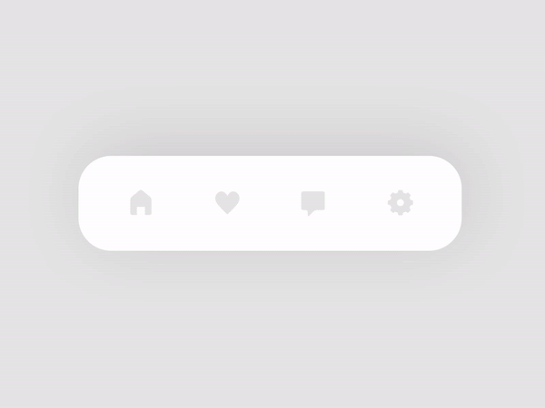
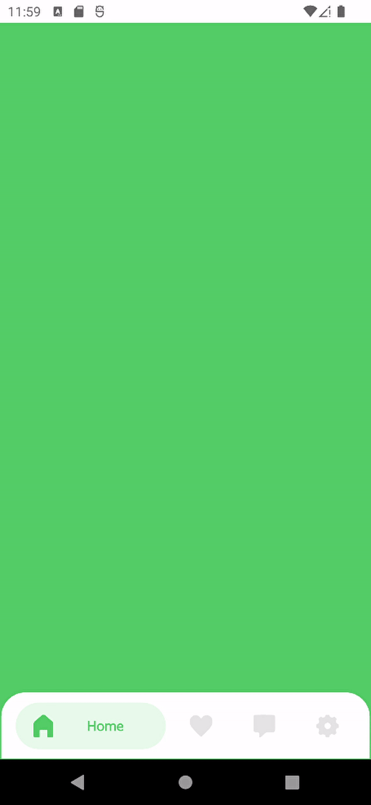
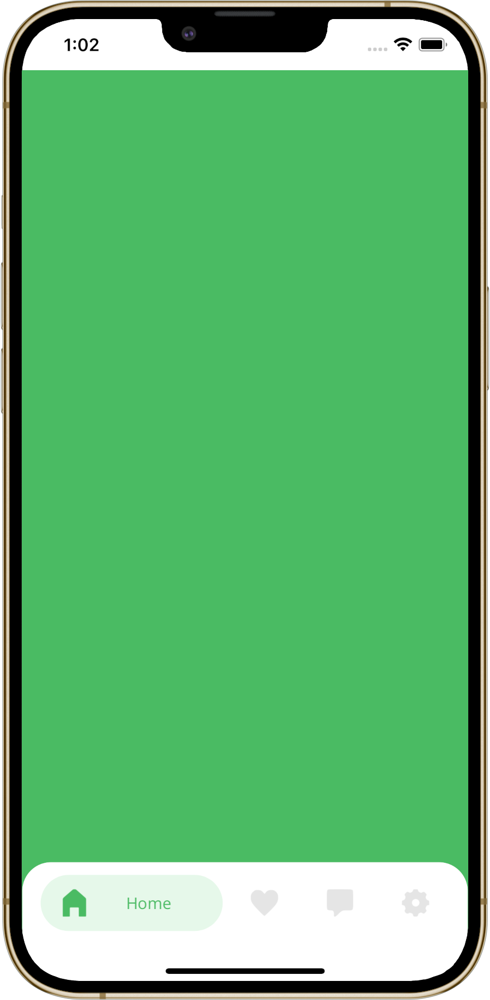
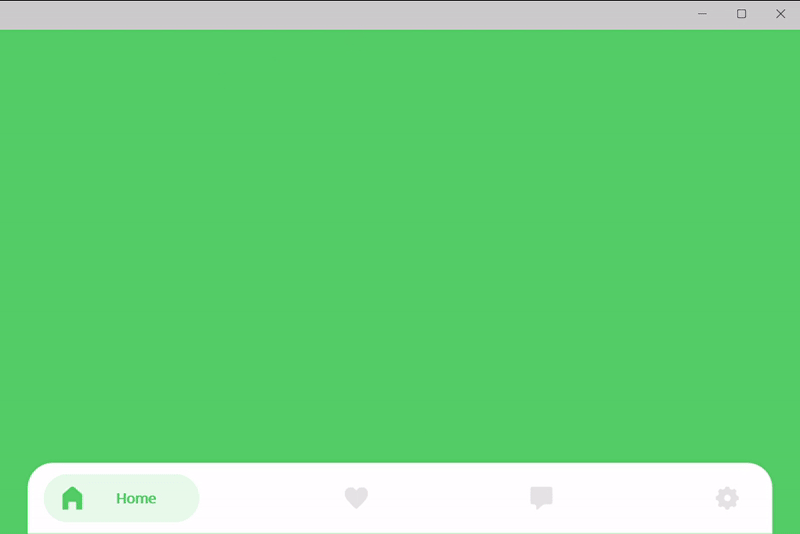

# Tab Bar Switches Interaction

**.NET MAUI** implementation of [Tab Bar Switches Interaction](https://dribbble.com/shots/14028381-Tab-Bar-Switches-Interaction) design by [Ronas IT | UI/UX Team](https://dribbble.com/ronasit).

## Original design

    

## My .NET MAUI implementation

The application was built using .NET MAUI APIs and my library [SimpleToolkit](https://github.com/RadekVyM/SimpleToolkit).

    
    &nbsp;&nbsp;&nbsp;&nbsp;&nbsp;&nbsp;&nbsp;
    

    

### Supported platforms

These are all the platforms I tested the app on:

- Android
- iOS (macOS)
- Windows

### Features

- Use of [SimpleToolkit](https://github.com/RadekVyM/SimpleToolkit) library
    - `SimpleShell`
    - `ContentButton`
- Animations